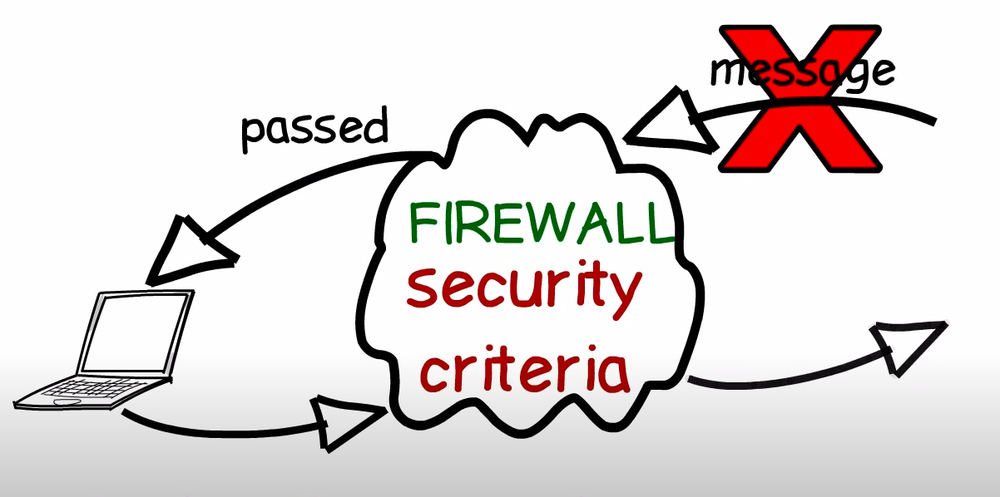
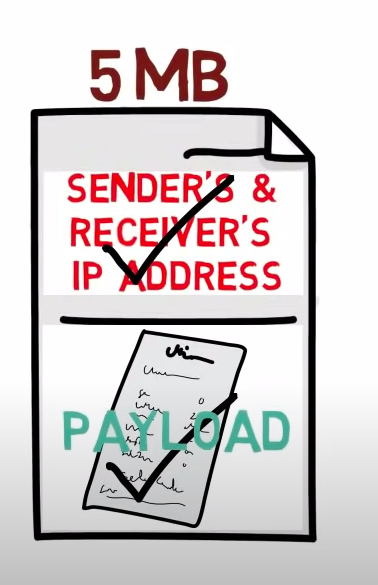

# **Firewalls**

 

***Firewall*** is a software program or computer hardware that can protect our network from external network or internet. 

It prevents :

* unauthorsied access to our private data stored in our computer.
* malicious software from infecting your computer.
* unwanted traffic.

 

## **Working of firewall**

A firewall acts as a gatekeeper or traffic controller that filters the connection between our computer and the internet. The firewall only allows those connections that it has been told to accept. It follows a set of pre-defined *security rules* for inspecting the [packets](https://en.wikipedia.org/wiki/Network_packet) ( pieces of data that are formatted for internet transfer ) being exchanged. The packets which does not follow the rule sets will be barred from entering the guarded network.

## **Types of firewalls**

Firewalls are either categorised by the way they filter data or by the system they protect. When categorising by what they protect, the two types are :
  1. 

Network based firewalls. 

                
Often hardware based like <a href="https://www.bitdefender.com/smart-home/">Bitdefender BOX</a>,<a href="https://www.cisco.com/c/en_in/products/security/asa-firepower-services/index.html"> Cisco ASA 5500-X</a>, etc.

  2. 

Host based firewalls. 

                
Often software based like Windows Firewall, Zscaler Internet Access, etc. 

When categorising by the filtering method, the main types are:

### 1. **Packet-filtering firewalls**

-  When a packet passes through a packet-filtering firewall, Its source, destination address, protocol, and destination port number are checked.
 
 - The packet is dropped if it does abide the firewall's rule set.
 - It examines each packet independently and does not know whether any given packet is part of an existing stream of traffic.
 - They are used in broadband Routers.
  

<b>Limitation</b>

The packet-filtering firewall is effective, but because it processes each packet in isolation, it can be vulnerable to IP spoofing attacks and has largely been replaced by stateful inspection firewalls.

 
   

### 2. **Stateful inspection firewalls**

- Also known as dynamic packet filtering firewalls.
- It monitors both incoming & outgoing packets.
- This type maintains a table called Conversation list which keeps track of all open connections.
- When a new packet arrives it determines whether the packet is part of an established connection, if yes, the packet is allowed through. Else it is evaluated according to the rule set for new connections.

<b>Limitation</b>

It can be vulnerable to denial-of-service (DoS) attacks as DoS attacks work by taking advantage of established connections that this type generally assumes are safe.

 
    

### 3. **Application layer and proxy firewalls**

- This type works at the [application layer](https://en.wikipedia.org/wiki/Application_layer) while the previous types work at the [network layer](https://en.wikipedia.org/wiki/Network_layer).
- It examines the payload to distinguish valid requests from malicious code disguised as a valid request for data.
- The presence of the proxy server makes it hard for the attacker to discover where the network actually is and creates another layer of security.
- The key benefit of this type is its ability to block specific content such as certain websites, known malware and to recognise when certain applications or protocols are being misused.

### 4. **Next generation firewalls (NGFW)**

- This type is a combination of other types where it combines the strengths and weaknesses of each type.
- With the knowledge of other types, this type makes the decision-making process of the firewall more powerful. 

## **Good practices to secure your device**

- Never turn your firewall off!
- Keep your software updated.
- Scan the portable devices with the help of Antivirus before connecting.
- Beware of the connections that you add as an exception to the firewall.

## References

- [Wikipedia.org-firewalls](https://en.wikipedia.org/wiki/Firewall_(computing)#References)
- [techtarget.com](https://www.techtarget.com/searchsecurity/definition/firewall)
  
- [Wikipedia.org-OSI](https://en.wikipedia.org/wiki/OSI_model)

  
